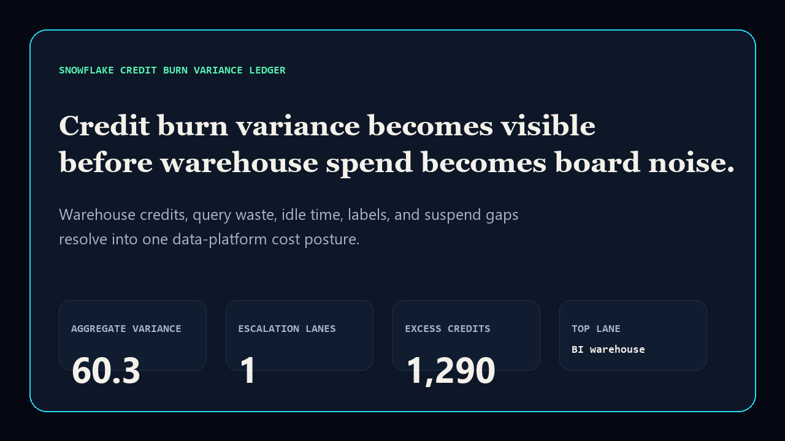
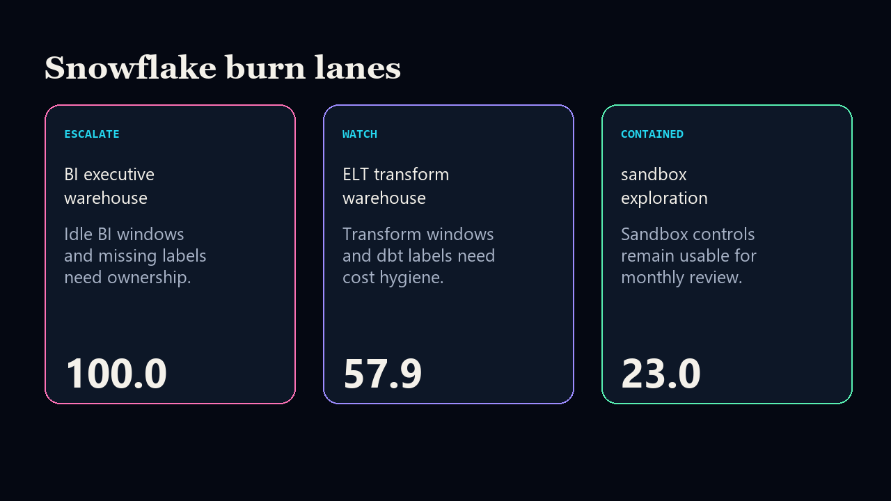

# snowflake-credit-burn-variance-ledger

[](https://github.com/mizcausevic-dev/snowflake-credit-burn-variance-ledger/actions/workflows/ci.yml)
[](https://github.com/mizcausevic-dev/snowflake-credit-burn-variance-ledger/actions/workflows/pages.yml)
[](LICENSE)

Snowflake credit-burn variance ledger for warehouse spend drift, query waste, idle warehouses, unlabeled work, auto-suspend gaps, and owner accountability.

- Live: https://mizcausevic-dev.github.io/snowflake-credit-burn-variance-ledger/
- Repo: https://github.com/mizcausevic-dev/snowflake-credit-burn-variance-ledger




## Why this exists

Snowflake cost governance is not just cheaper warehouses. It is spend variance, failed queries, unlabeled work, idle time, and missing ownership becoming visible before the finance narrative turns into generic cloud-spend noise.

## What it includes

- Python scoring engine and CLI
- synthetic Snowflake warehouse credit-burn fixture
- Snowflake SQL extraction contract
- static GitHub Pages surface
- README proof renders
- CI tests, SQL contract check, prerender smoke test

## Local run

```bash
python -m pip install -e .
python -m unittest discover -s tests
python scripts/run_demo.py
python -m snowflake_credit_burn_variance_ledger.cli fixtures/credit_burn_variance.json --format json
```

## Board-readable output

- aggregate credit-burn variance score
- escalation-lane count
- excess credit estimate
- posture per warehouse lane: `escalate`, `watch`, or `contained`
- primary recommendation tied to the highest-risk warehouse
